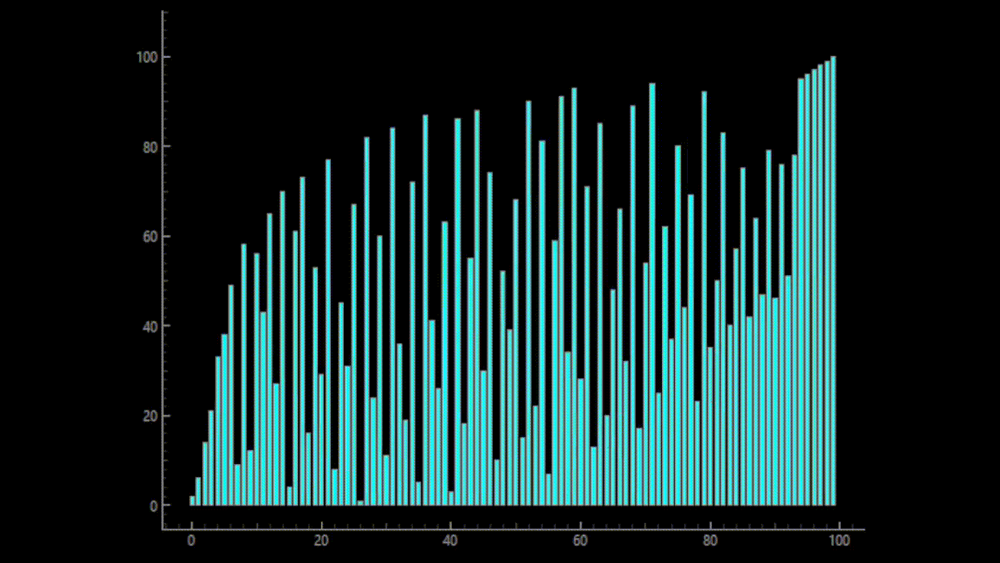

## Bubble Sort

Bubble sort is a simple sorting algorithm that repeatedly steps through a list, compares adjacent elements, and swaps them if they are in the wrong order.

With each pass, the largest unsorted element “bubbles up” to its correct position at the end of the list.

**Time Complexity:** O(n²)  
**Best for:** Learning and visualization  
**Not suitable for:** Large datasets

